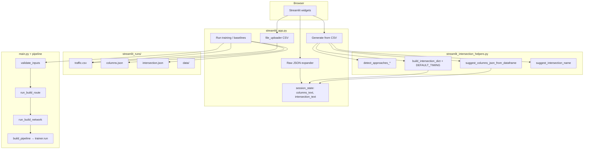

# Streamlit UI architecture

This document describes how the **Streamlit front end** (`streamlit_app.py`) relates to **CSV → JSON generation** and to the **training / baseline** code paths shared with `main.py`.

For how to run the app, see [FRONTEND.md](FRONTEND.md).

---

## Big picture

- **One Python process**: Streamlit renders the UI and, for training, calls into `main.py` in-process (same interpreter).
- **No React/Node**: widgets, uploads, and charts are Streamlit components.
- **Scratch directory**: runtime inputs/outputs for the UI live under **`streamlit_runs/`** (typically gitignored), not under `src/` unless you copy files yourself.

---

## Session state vs files on disk

| Artifact | Where it lives in the UI | Loaded from disk on page open? |
|----------|---------------------------|---------------------------------|
| CSV | Uploaded bytes → `streamlit_runs/traffic.csv`; preview in memory | **No.** On each **new Streamlit session**, stale `traffic.csv` is deleted so nothing works until the user uploads again. |
| `columns.json` / `intersection.json` text | `st.session_state` keys `columns_text`, `intersection_text`, bound to text areas | **No.** Empty strings until **Generate from CSV**, suggest expander **Apply** buttons, or manual paste. |
| `streamlit_runs/columns.json`, `intersection.json` | Written only when you click **Run training pipeline** or **Evaluate baselines only** | These files are **outputs** for subprocess / `main.py`, not **inputs** that repopulate the editors. |

So “JSON conversion” results live in **session state** first; disk JSON under `streamlit_runs/` is a snapshot at run time.

---

## CSV → JSON: where the logic lives

### Entry points in `streamlit_app.py`

1. **Generate from CSV** (primary path)  
   Calls `_apply_generated_config_from_dataframe(df)`, which:
   - infers active approaches from CSV column names;
   - builds a column map object and an intersection object;
   - assigns `json.dumps(...)` into `st.session_state.columns_text` and `st.session_state.intersection_text`.

2. **Field forms** (`streamlit_config_forms.py`) and optional **Raw JSON** paste keep those strings in sync when the user edits without writing JSON by hand.

### Core rules in `streamlit_intersection_helpers.py`

| Concern | Function(s) |
|---------|----------------|
| Which directions (N/S/E/W) are active | `detect_approaches_from_headers` — regex on names like `n_approaching_*`. `detect_approaches_from_column_map` when a column map already exists. |
| Human-readable intersection id | `suggest_intersection_name` — looks for columns such as `location_name`, `Location`, `intersection`. |
| Shape of **`columns.json`** | `suggest_columns_json_from_dataframe` — `time.*` from known headers (or first column with `"time"` in the name); per-direction `through` / `right` / `left` / `peds` via `_pick_col` (Toronto-style `n_approaching_t`, etc.). |
| Shape of **`intersection.json`** | `build_intersection_dict` — lane counts and speed from UI or defaults; merges **`DEFAULT_TIMING`** (phases, greens, amber, cycle, edge length, …). |

The pipeline (`main.py`, SUMO builders, rewards) expects the same JSON schema as the CLI; the helpers only **propose** that schema from the CSV headers and fixed defaults (e.g. 2/1/1 lanes, 50 km/h on quick generate).

---

## Running training from the UI

When **Run training pipeline** is clicked (after validation):

1. CSV and JSON strings are flushed to `streamlit_runs/traffic.csv`, `columns.json`, `intersection.json`.
2. The app assigns **`main` module globals** to point at those paths (`CSV_PATH`, `INTERSECTION_PATH`, `COLUMNS_PATH`, `OUT_DIR`, epochs, SIM_*, etc.) and recomputes derived values (`TOTAL_UPDATES`, `EPSILON_DECAY`) via `_recompute_derived`.
3. It runs the same sequence as a well-configured CLI session:  
   `validate_inputs` → `run_build_route` → `run_build_network` → `_create_run_dir` → `build_pipeline` → `trainer.run()`.
4. A **`Trainer.log_callback`** streams stdout-style lines into the page (log + reward chart).

Artifacts (logs, models) go under **`logs/<timestamp>_.../`** like the CLI.

---

## Baselines from the UI

**Evaluate baselines only** reuses the same path setup and build steps, then runs **`evaluate_baseline.py` in a subprocess** with a small JSON config written under `streamlit_runs/`. DQN comparison uses **`last_run_dir`** from session state when you trained in the same tab; otherwise a fallback folder under `streamlit_runs/`.

---

## File map (quick reference)

| File | Role |
|------|------|
| `streamlit_app.py` | UI layout, session lifecycle (e.g. CSV scrub), wiring to `main`, live training display, baseline subprocess. |
| `streamlit_intersection_helpers.py` | Pure helpers: header/column-map detection, suggested JSON dicts, timing defaults. |
| `main.py` | Shared training/simulation entry: validation, route/network build, pipeline builder. |
| `evaluate_baseline.py` | Baseline evaluation CLI invoked by Streamlit. |
| `streamlit_runs/` | Per-machine scratch: uploaded CSV, written JSON at run time, eval config, optional `data/` output path for `main.OUT_DIR`. |

---

## Limitations (unchanged from CLI assumptions)

- Policy and reward classes are whatever `main.py` imports; the Streamlit UI does not switch algorithms.
- Long training blocks the Streamlit script run; for very long jobs, prefer `python main.py` in a terminal.
